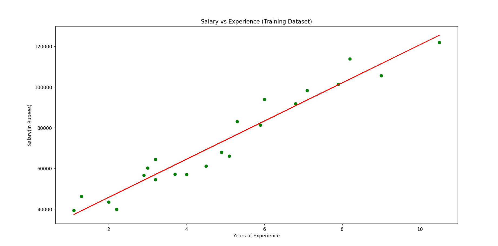
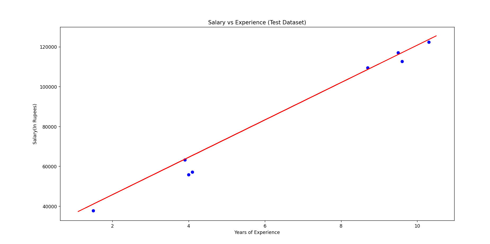

# Salary Prediction using Simple Linear Regression

## Overview

This project demonstrates how to build a Simple Linear Regression model using Python and Scikit-learn to predict an employee's salary based on years of experience.

The dataset contains two columns:

- **YearsExperience** (Independent Variable)
- **Salary** (Dependent Variable)

The model is trained on the dataset and predicts the salary for a given number of years of experience.

---

## Features

- Reads the salary dataset from a CSV file
- Separates independent and dependent variables
- Splits the dataset into training and testing sets
- Trains a Simple Linear Regression model
- Predicts salary for a given years of experience
- Visualizes the regression line for the training dataset
- Visualizes the regression line for the testing dataset

---

## Project Structure

```text
salary_prediction/
│
├── images/
│   ├── training_dataset.png
│   └── testing_dataset.png
├── salary_prediction.py
├── salary_data.csv
└── README.md
```

---

## Dataset

The dataset contains the following columns:

| Column | Description |
|---------|-------------|
| YearsExperience | Employee's years of experience |
| Salary | Employee's salary |

### Sample Data

| YearsExperience | Salary |
|-----------------|---------|
| 1.1 | 39343 |
| 1.3 | 46205 |
| 2.0 | 43525 |
| 5.3 | 83088 |
| 7.9 | 101302 |
| 10.5 | 121872 |

---

## Technologies Used

- Python
- NumPy
- Pandas
- Matplotlib
- Scikit-learn
- Anaconda Prompt

---

## Requirements

This project was developed and executed using Anaconda.

Install the required libraries if they are not already available:

```bash
pip install numpy pandas matplotlib scikit-learn
```

Or simply run the project using your Anaconda environment.

---

## How to Run

1. Open **Anaconda Prompt**.
2. Navigate to the project folder.

```bash
cd path_to_project
```

3. Run the program.

```bash
python salary_prediction.py
```

---

## Workflow

1. Load the dataset.
2. Display the dataset.
3. Extract the independent and dependent variables.
4. Split the dataset into training and testing sets.
5. Train the Simple Linear Regression model.
6. Predict the salary for 10 years of experience.
7. Display the predicted salary.
8. Visualize the regression line on the training dataset.
9. Visualize the regression line on the testing dataset.

---

## Sample Input

The model predicts salary based on years of experience.

**Example:**

```text
Years of Experience = 10
```

---

## Sample Output

```text
Dataset Preview

   YearsExperience    Salary
0              1.1   39343.0
1              1.3   46205.0
2              1.5   37731.0
3              2.0   43525.0
4              2.2   39891.0

Independent Value

[[1.1]
 [1.3]
 [1.5]
 ...
 [10.5]]

Dependent Value

[39343. 46205. 37731. ... 121872.]

Predicted Salary for 10 Years of Experience

[119905.85]
```

> **Note:** The predicted salary may vary slightly depending on the Scikit-learn version and floating-point calculations.

---

## Output

The program generates the following outputs:

- Dataset preview
- Independent variable values
- Dependent variable values
- Training dataset
- Testing dataset
- Predicted salary for 10 years of experience
- Training dataset regression graph
- Testing dataset regression graph

### Training Dataset Regression

The graph below shows the regression line fitted to the training dataset.



### Testing Dataset Regression

The graph below shows the regression line applied to the testing dataset.



---

## Learning Objectives

This project demonstrates the following machine learning concepts:

- Data preprocessing
- Train-test splitting
- Simple Linear Regression
- Model training
- Salary prediction
- Data visualization using Matplotlib

---

## License

This project is intended for educational and learning purposes.
